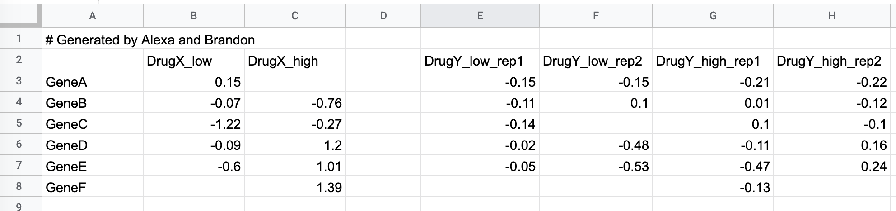

```{r setup, include=FALSE}
knitr::opts_chunk$set(echo = TRUE, warning=FALSE, message=FALSE, comment = "", collapse=TRUE)
options(width=60)

library(tidyverse)
library(kableExtra)
```


## Real-world data is often messy

Data files you generate or will be given may...

* Be poorly organized
* Have missing values
* Contain extraneous information
* Confounds variables and labels


## Tidy data 

To facilitate downstream analyses, data should be organized in a manner such that...

  1. Each variable must have its own column.
  1. Each observation must have its own row.
  1. Each value must have its own cell.
  
## tidyr and dplyr provide powerful functions for data wrangling

Both `dplyr` and `tidyr` are loaded when we load the `tidyverse` metapackage:

```{r}
library(tidyverse)
```


## Example: Starting messy data

```{verbatim, size="footnotesize"}
# Generated by Alexa and Brandon
,DrugX_low,DrugX_high,,DrugY_low_rep1,DrugY_low_rep2,DrugY_high_rep1,DrugY_high_rep2
GeneA,0.15,,,-0.15,-0.15,-0.21,-0.22
GeneB,-0.07,-0.76,,-0.11,0.1,0.01,-0.12
GeneC,-1.22,-0.27,,-0.14,,0.1,-0.1
GeneD,-0.09,1.2,,-0.02,-0.48,-0.11,0.16
GeneE,-0.6,1.01,,-0.05,-0.53,-0.47,0.24
GeneF,,1.39,,,,-0.13,
```

{width=80%}

## Common problems with "raw" data files

 * Comment lines
 * Missing column headers
 * Genes are cases rather than variables
 * Confounds treatment, dosage, and replicates
 * Blank columns --  used for visual organization in spreadsheet, but interferes with analysis
 


## Naively reading the data produces poor results

```{r, echo=FALSE,results='hide'}
library(tidyverse)
```


```{r}
messy <- read_csv("~/Desktop/small-messy-data.csv")
```

```{r,echo=FALSE}
knitr::kable(messy) %>%
  kable_styling(bootstrap_options = "striped", font_size = 14)
```


## Explore options of your reader function(s)

Example: filtering comment lines

```{r}
messy <- read_csv("~/Desktop/small-messy-data.csv", comment="#")
```

```{r,echo=FALSE}
knitr::kable(messy) %>%
  kable_styling(bootstrap_options = "striped", font_size = 14)
```


## Renaming columns using dplyr::rename

```{r}
messy <- 
  messy %>%
  rename(Gene = "...1")
```

```{r,echo=FALSE}
knitr::kable(messy) %>%
  kable_styling(bootstrap_options = "striped", font_size = 14)
```

## Dropping columns using select

```{r, results='hide'}
messy %>%
  select(-"...4")
```
```{r,echo=FALSE}
messy %>%
  select(-"...4") %>%
  knitr::kable() %>%
  kable_styling(bootstrap_options = "striped", font_size = 14)
```


## Dropping columns using select and where

If you had many columns it might not be feasible to specify the names directly. The `where` helper function can be used to specify a function to determine column selection.

```{r}
messy <-
  messy %>%
  select(-where( function(x) all(is.na(x)) ))
```

```{r,echo=FALSE}
knitr::kable(messy) %>%
  kable_styling(bootstrap_options = "striped", font_size = 14)
```

## Reshaping a data frame using pivoting

`tidyr::pivot_longer`:

```{r, results='hide'}
long_messy <-
  messy %>%
  pivot_longer(-Gene, names_to="Drug_Dosage_Rep", values_to="Expression")
```

```{r,echo=FALSE}
knitr::kable(long_messy[1:10,]) %>%
  kable_styling(bootstrap_options = "striped", font_size = 14, full_width = FALSE)
```


## Extract a column in multiple columns

`tidyr::select` is easy to use if the parts of interest are separated by a consistent pattern. `tidyr::extract` provides more powerful regex based matching.

```{r, results='hide'}
split_long_messy <-
  long_messy %>%
  separate("Drug_Dosage_Rep", into=c("Drug", "Dosage", "Replicate"), sep="_")
```
```{r,echo=FALSE}
knitr::kable(split_long_messy[1:10,]) %>%
  kable_styling(bootstrap_options = "striped", font_size = 14, full_width = FALSE)
```

## Filling missing data 

`tidyr::fill` and `tidyr::replace_na`

```{r}
tidy_data <-
  split_long_messy %>%
  replace_na(list(Replicate = "rep1"))
```
```{r,echo=FALSE}
knitr::kable(tidy_data[1:10,]) %>%
  kable_styling(bootstrap_options = "striped", font_size = 14, full_width = FALSE)
```
## Tidy data enables complex summaries

```{r, results='hide'}
tidy_summary <-
  tidy_data %>%
  group_by(Gene, Drug, Dosage) %>%
  summarize(Mean_Expression = mean(Expression, na.rm=TRUE))

```
```{r,echo=FALSE}
knitr::kable(tidy_summary[1:10,]) %>%
  kable_styling(bootstrap_options = "striped", font_size = 14, full_width = FALSE)
```


## Tidy data enables complex plotting 

```{r, out.width="70%", fig.align='center'}
tidy_summary %>%
  ggplot(aes(x = Dosage, y = Mean_Expression, color=Drug)) + 
  geom_point(alpha=0.5) + 
  geom_line(aes(group=Drug)) +
  facet_wrap(~Gene)
```

## Summary and raw values as different ggplot layers

```{r, out.width="70%", fig.align='center'}
tidy_summary %>%
  ggplot(aes(x = Dosage, y = Mean_Expression, color=Drug)) + 
  geom_point(alpha=0.85, size=3) + 
  geom_line(aes(group=Drug)) +
  geom_point(data=tidy_data, 
             mapping=aes(x = Dosage, y = Expression, color=Drug),
             alpha = 0.5, size = 1.5, 
             inherit.aes = FALSE) + 
  facet_wrap(~Gene)
```


## Widening

`tidyr::pivot_wider` spreads data across columns:

```{r, results='hide'}
tidy_summary %>%
  pivot_wider(names_from = Gene, values_from = Mean_Expression)
```

```{r,echo=FALSE}
tidy_summary %>%
  pivot_wider(names_from = Gene, values_from = Mean_Expression) %>%
  knitr::kable() %>%
  kable_styling(bootstrap_options = "striped", font_size = 14, full_width = FALSE)
```

```{r, results='hide'}
tidy_summary %>%
  ungroup() %>%  # ungroup important here
  pivot_wider(names_from = Gene, values_from = Mean_Expression) %>%
  select(!c(Drug,Dosage,GeneF)) %>%
  cor(use = "pairwise.complete.obs" )
```
 
```{r,echo=FALSE}
tidy_summary %>%
  ungroup() %>%  # ungroup important here
  pivot_wider(names_from = Gene, values_from = Mean_Expression) %>%
  select(!c(Drug,Dosage,GeneF)) %>%
  cor(use = "pairwise.complete.obs" ) %>%  
  knitr::kable() %>%
  kable_styling(bootstrap_options = "striped", font_size = 14, full_width = FALSE)
``` 

 
 