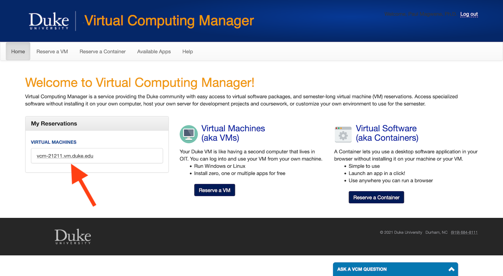

## Logging into your Duke VM using SSH

SSH (Secure SHell) is a program for logging into a remote machine and executing commands on that machine. Modern versions of Mac OS and Windows both include SSH clients by default. 


### Hostname of your VM

To login to your Duke VM you will need to know the "hostname" of your VM.  You can see this information under the "My Reservations" toolbar on the left of the [VCM](https://vcm.duke.edu/) website.




### Using SSH

Once you know the hostname of your VM you can login by executing the `ssh` program from the command line as so (replace `netid` with your actual NetID and `hostname` with the hostname for your VM)

```
ssh netid@hostname  
```

You will be prompted for your NetID and password.  When you type your password the results will not be echoed to the screen, so be sure to type it in carefully.


### Logging into your VM from off campus

If you wish to login to your virtual machine from off-campus (outside the Duke network) you will need to run Duke's VPN software (https://oit.duke.edu/what-we-do/services/vpn). A VPN (virtual private network) creates a secure connection from your computer to Duke's network.  


